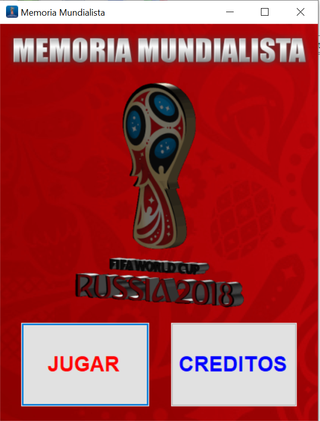
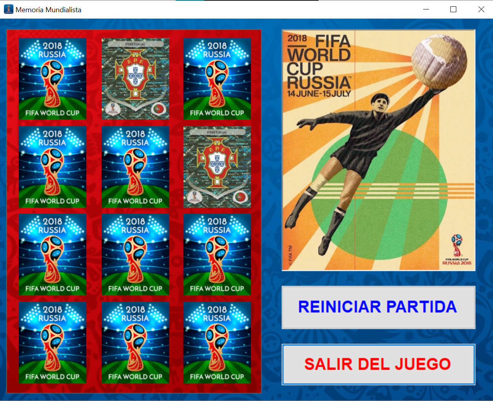
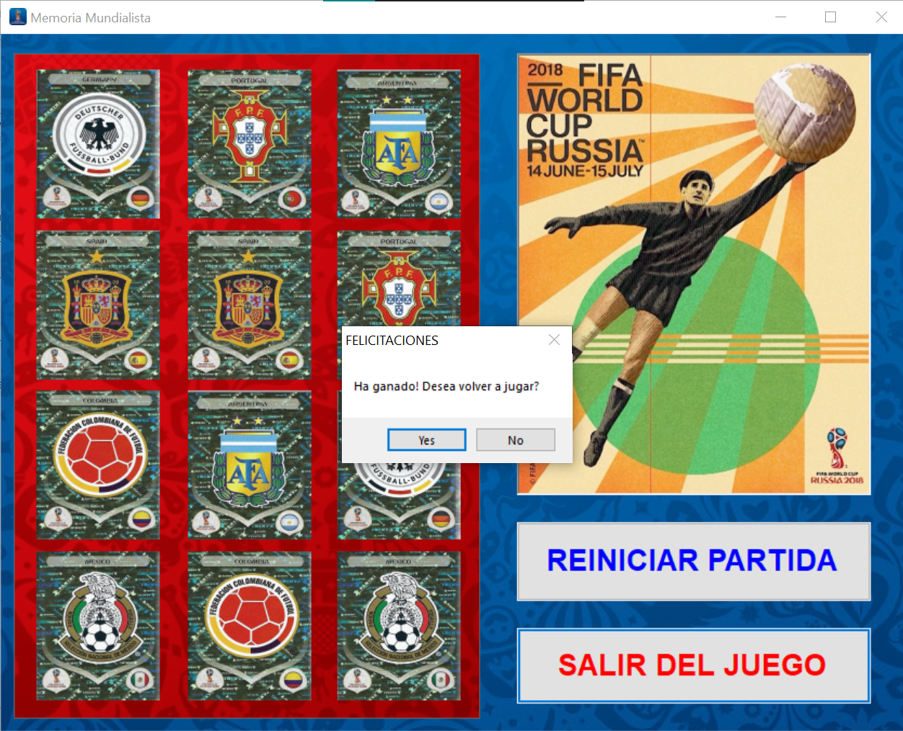

#  2018-FIFA-World-Cup-Memory-Game

This is a  tiny but fun Memory Videogame I created using C# on Visual Studio .NET 2010 as a fangame for the Russia's 2018 FIFA World Cup ⚽ .

## Installation & How to Play the game 

No need to, if you want to play it just enter into the MemoriaMundialistaFinal\MemoriaMundialistaFinal\obj\x86\Release folder and click into the MemoriaMundialistaFinal.exe app. It will start the game. Play "Jugar", click on a pair of cards and try to match them all! ✨

## Screenshots:

## License
[MIT](https://choosealicense.com/licenses/mit/)
